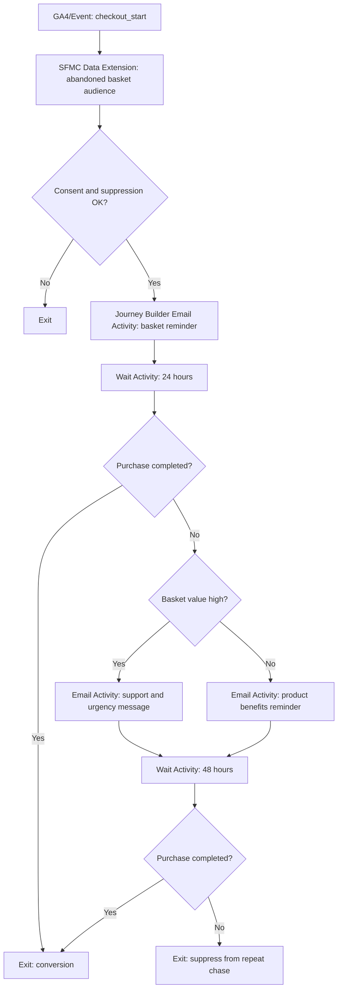

# Abandoned Basket Journey

## Scenario

Use when a known customer starts checkout but does not purchase. Example stack: Salesforce Marketing Cloud Engagement, GA4, Movable Ink.

## Journey Strategy

- Objective: Recover qualified baskets without over-contacting customers.
- Primary KPI: recovered revenue within 7 days.
- Entry: checkout_start with no purchase after 1 hour.
- Exclusions: purchase completed, no email consent, recent abandonment journey, low stock, restricted product, global suppression.
- Re-entry: allowed after 14 days if a new basket is created.

## Diagram



## Platform Notes

- SFMC Journey Builder owns Entry Source, Wait Activities, Decision Splits, Email Activities, Goal, and Exit Criteria.
- Data Extension must include Contact Key, basket_id, product_ids, basket_value, product_url, consent, suppression, and checkout_start_time.
- Movable Ink can render basket contents or fallback to category best sellers if product feed data is incomplete.

## YAML Sketch

```yaml
journey:
  name: Abandoned Basket Journey
  type: basket_abandonment
  lifecycle_stage: commerce
  primary_kpi: recovered_revenue_7d
  reentry_rules:
    allowed: true
    cooldown: 14d
```

