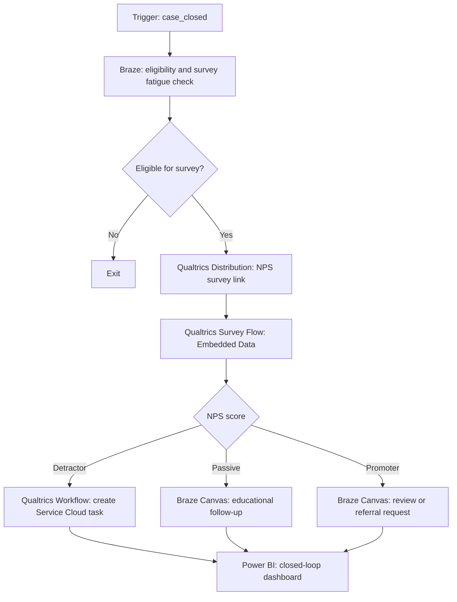

# NPS Closed-loop Feedback Journey

## Scenario

Use after a service interaction, onboarding milestone, purchase, renewal, or customer support case closure. Example stack: Qualtrics, Braze, Salesforce Service Cloud, Power BI.

## Journey Strategy

- Objective: Capture NPS, recover detractors, and encourage promoters to advocate.
- Primary KPI: closed-loop detractor resolution rate.
- Entry: case_closed or milestone_completed.
- Exclusions: recent survey in last 30 days, no survey consent where required, vulnerable customer restriction, open complaint, global suppression.
- Exit: survey completed, service task created, advocacy request completed, or survey window expired.

## Diagram



## Platform Notes

- Qualtrics owns Survey Project, Survey Flow, Embedded Data, Distribution, Branch Logic, Response Triggers, Workflows, and survey dashboard.
- Braze owns eligibility checks, survey invitation, follow-up journey, and fatigue suppression.
- Salesforce Service Cloud owns detractor follow-up tasks with SLA and owner.
- Power BI owns NPS trend, response rate, detractor closure, and operational alerts.

## YAML Sketch

```yaml
journey:
  name: NPS Closed-loop Feedback Journey
  type: nps_feedback
  lifecycle_stage: service
  primary_kpi: detractor_resolution_rate
  surveys:
    - tool: Qualtrics
      survey_type: NPS
      embedded_data:
        - customer_id
        - case_id
        - journey_id
        - service_channel
      response_actions:
        - detractor_create_service_task
        - promoter_request_review
```
