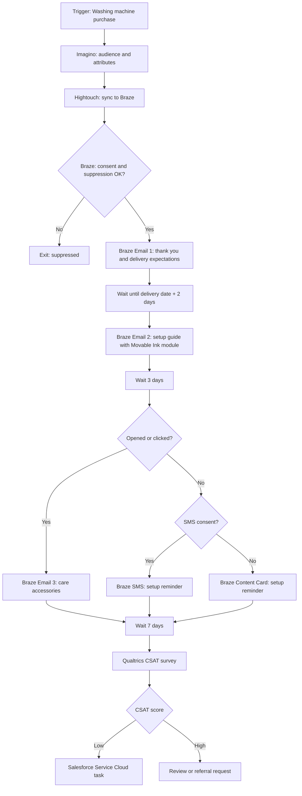

# Washing Machine Post-Purchase Journey

## Scenario

Use when a customer buys a high-consideration product and needs setup support, feedback capture, and cross-sell. Example stack: Imagino, Hightouch, Braze, Movable Ink, Qualtrics, GA4, Salesforce Service Cloud.

## Journey Strategy

- Objective: Reduce post-purchase anxiety, improve setup, collect CSAT, and create relevant cross-sell.
- Primary KPI: accessory purchase within 30 days.
- Secondary KPIs: CSAT, setup-guide click rate, support contact reduction.
- Entry: purchase event with product_category = washing_machine.
- Exclusions: no consent for selected channel, open complaint, hard bounce, recent similar journey.

## Diagram



## Platform Notes

- Braze owns Canvas orchestration, Action Paths, Message Steps, SMS fallback, Content Card fallback, and conversion events.
- Movable Ink owns product recommendation content module and fallback creative.
- Qualtrics owns Survey Project, Embedded Data, Branch Logic, and response-triggered workflows.
- Salesforce Service Cloud owns service recovery task creation for low CSAT.

## YAML Sketch

```yaml
journey:
  name: Washing Machine Post-Purchase Journey
  type: post_purchase
  lifecycle_stage: retention
  primary_kpi: accessory_purchase_rate_30d
  surveys:
    - tool: Qualtrics
      survey_type: CSAT
      trigger: delivery_date_plus_7d
      embedded_data:
        - customer_id
        - order_id
        - product_category
        - journey_id
```

