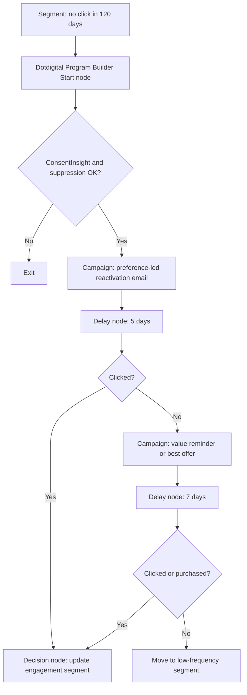

# Low Engagement Reactivation Journey

## Scenario

Use when customers have not engaged recently but still have marketing consent. Example stack: Dotdigital, GA4, Power BI.

## Journey Strategy

- Objective: Reactivate low-engagement contacts or move them to lower-frequency treatment.
- Primary KPI: reactivation click rate.
- Entry: no email click in 120 days and active consent.
- Exclusions: unsubscribed, hard bounce, open complaint, recent purchase, vulnerable customer restriction, global suppression.
- Exit: click, purchase, preference update, unsubscribe, or final non-engagement.

## Diagram



## Platform Notes

- Dotdigital owns Address Book, Segment, Contact Data Fields, Program Builder enrolment, Decision nodes, Delay nodes, Campaign sends, and ConsentInsight checks.
- GA4 supplies onsite conversion events where available.
- Power BI reports reactivation, opt-out, complaint, and future engagement lift.

## YAML Sketch

```yaml
journey:
  name: Low Engagement Reactivation Journey
  type: reactivation
  lifecycle_stage: retention
  primary_kpi: reactivation_click_rate
  entry_criteria:
    consent:
      - email_marketing_opt_in_true
    frequency_cap: no_more_than_2_reactivation_messages_in_30d
```

