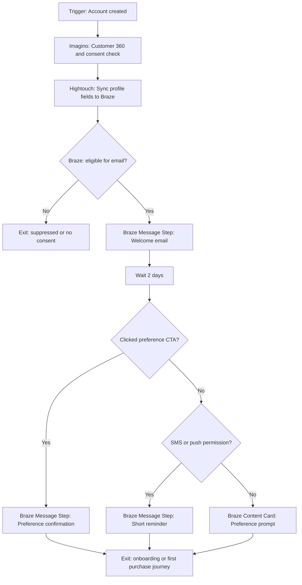

# New Customer Welcome Journey

## Scenario

Use when a customer creates an account or makes their first opt-in. Example stack: Imagino, Hightouch, Braze, GA4.

## Journey Strategy

- Objective: Convert a new customer from signup to first value moment.
- Primary KPI: Preference centre completion or first meaningful click.
- Entry: account_created or newsletter_signup.
- Exclusions: no email consent, global suppression, existing active customer journey, staff/test accounts.
- Exit: preference captured, first purchase, unsubscribe, or max welcome touches reached.

## Diagram



## Platform Notes

- Imagino owns identity resolution, lifecycle stage, and calculated preference completeness.
- Hightouch owns field sync to Braze with customer_id as match key.
- Braze owns Canvas Entry Criteria, Message Steps, Delay steps, Action Paths, and conversion events.
- GA4 owns onsite preference centre events and conversion reporting.

## YAML Sketch

```yaml
journey:
  name: New Customer Welcome Journey
  type: welcome
  lifecycle_stage: onboarding
  primary_kpi: preference_completion_rate
  trigger:
    type: event
    event_name: account_created
  steps:
    - step_id: welcome_email
      platform: Braze
      platform_object: Canvas Message Step
      channel: email
      timing: immediate
      fallback: generic greeting if first_name is missing
```

