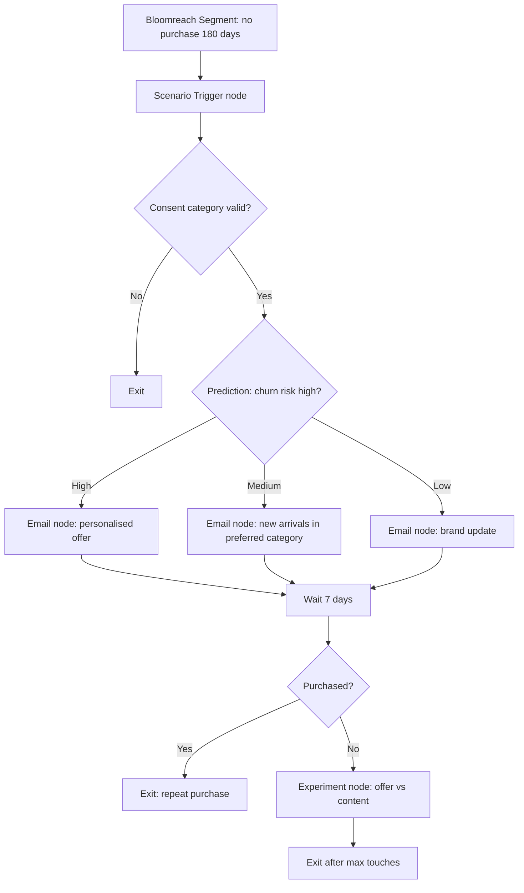

# Lapsed Customer Win-back Journey

## Scenario

Use when customers have not purchased for a defined period and need a relevant reason to return. Example stack: Bloomreach Engagement, product catalog, GA4.

## Journey Strategy

- Objective: Win back lapsed customers with personalised category or offer messaging.
- Primary KPI: repeat purchase rate within 30 days.
- Entry: no purchase in 180 days and marketing consent active.
- Exclusions: no consent category, recent win-back exposure, open complaint, returned latest purchase unresolved, global suppression.
- Re-entry: after 180 days only if a new lapse condition occurs.

## Diagram



## Platform Notes

- Bloomreach owns Scenario, Segment, Trigger, Condition nodes, Email nodes, Wait nodes, Experiment node, Predictions, Recommendations, Catalogs, and consent category enforcement.
- Product recommendations must fall back from next best product to preferred category best sellers, then to overall best sellers.
- GA4 tracks onsite purchase and campaign attribution.

## YAML Sketch

```yaml
journey:
  name: Lapsed Customer Win-back Journey
  type: win_back
  lifecycle_stage: retention
  primary_kpi: repeat_purchase_rate_30d
  experiments:
    - name: Offer vs content win-back
      type: A/B
      primary_metric: purchase_rate_30d
```

