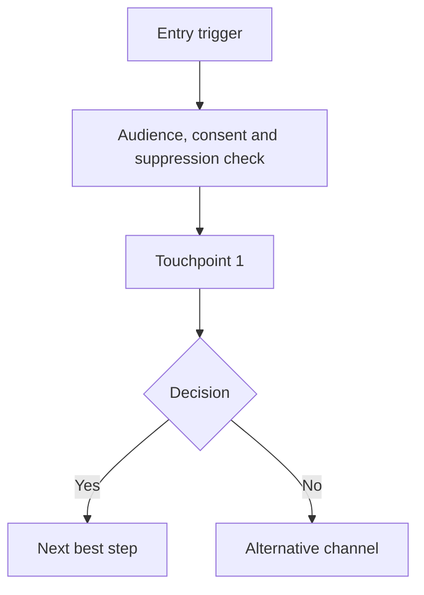

# Output Contract

Use this reference when producing a complete journey design.

## Required Section Order

```markdown
# [Journey Name]

## 1. Executive Summary

## 2. Confirmed Requirements

## 3. Assumptions

## 4. Open Questions

## 5. Journey Strategy

## 6. Platform Implementation Plan

## 7. Platform Capability Matrix

## 8. Journey Diagram

## 9. Journey Element Details

## 10. Decision Logic

## 11. Personalisation and Recommendation Logic

## 12. Testing Plan

## 13. Survey and Feedback Plan

## 14. Tracking and Measurement Plan

## 15. Data Requirements

## 16. Compliance and Governance Checks

## 17. Platform-specific Build Notes

## 18. Build Checklist

## 19. YAML Journey Specification

## 20. Optimisation Opportunities
```

If the user asks for a narrower output, keep the relevant sections and preserve the same concepts.

## Mermaid Rules

Use Mermaid by default. The diagram must show:

- Entry trigger.
- Audience source or filter.
- Consent check.
- Suppression check.
- Touchpoints.
- Wait steps.
- Decision branches.
- Channel changes.
- A/B or holdout paths where relevant.
- Survey points.
- Conversion events.
- Exit criteria.
- Platform ownership.
- Tracking events where useful.

Default shape:



## Journey Element Template

For each material journey step, output:

```markdown
### Step [number]: [Step name]

- Purpose:
- Tool/platform:
- Platform object:
- Channel:
- Trigger/timing:
- Audience condition:
- Content:
- Personalisation:
- Data used:
- Tracking event:
- Success metric:
- Decision logic:
- Fallback logic:
- Suppression/compliance checks:
- Owner:
- Build notes:
```

## YAML Specification Shape

End complete journey designs with YAML using this shape:

```yaml
journey:
  name:
  type:
  lifecycle_stage:
  objective:
  customer_goal:
  business_goal:
  primary_kpi:
  secondary_kpis: []
  tools:
    orchestration:
    data:
    activation:
    dynamic_content:
    survey:
    analytics:
    crm:
  audience:
    inclusion: []
    exclusion: []
    estimated_size:
    required_fields: []
  trigger:
    type:
    source:
    event_name:
    schedule:
  entry_criteria:
    consent: []
    suppression: []
    frequency_cap:
    data_quality: []
  exit_criteria:
    - condition:
      destination:
  reentry_rules:
    allowed:
    cooldown:
  steps:
    - step_id:
      name:
      platform:
      platform_object:
      channel:
      timing:
      content:
      personalisation: []
      decision_logic:
      tracking: []
      fallback:
      compliance_checks: []
  experiments:
    - name:
      type:
      hypothesis:
      variants: {}
      split: {}
      primary_metric:
      guardrails: []
      success_rule:
  surveys:
    - tool:
      survey_type:
      trigger:
      embedded_data: []
      response_actions: []
  tracking:
    events: []
    attribution:
    dashboards: []
  data_requirements:
    profile_fields: []
    behavioural_events: []
    transaction_events: []
    offline_events: []
    calculated_attributes: []
  compliance:
    consent: []
    suppression: []
    frequency:
    legal:
    accessibility:
  build_checklist:
    - platform:
      tasks: []
```

See [../schemas/journey.schema.yaml](../schemas/journey.schema.yaml) when a stricter machine-readable schema is required.

## Build Checklist Templates

Use only relevant platforms.

### Braze

- [ ] Create Canvas.
- [ ] Configure Canvas Entry Criteria.
- [ ] Configure Entry Audience.
- [ ] Add suppression and frequency cap logic.
- [ ] Add Message Steps.
- [ ] Add Delay Steps.
- [ ] Add Audience Paths or Action Paths.
- [ ] Add Experiment Paths if testing.
- [ ] Configure Liquid personalisation.
- [ ] Configure Connected Content if needed.
- [ ] Configure Catalog references if needed.
- [ ] Configure conversion events.
- [ ] Configure Subscription Group checks.
- [ ] QA test users.
- [ ] Launch in test mode or controlled audience.

### Adobe Campaign

- [ ] Create Campaign or Workflow.
- [ ] Add Scheduler if recurring.
- [ ] Add Query activity.
- [ ] Add Enrichment activity if needed.
- [ ] Add Split activity for decision paths.
- [ ] Add Delivery activity.
- [ ] Apply Typology rules.
- [ ] Add seed addresses.
- [ ] Configure control group.
- [ ] Check broadlogs and tracking logs.
- [ ] Validate exclusions.
- [ ] Run proof.
- [ ] Start workflow.

### Salesforce Marketing Cloud

- [ ] Create or validate Data Extension.
- [ ] Configure Entry Source.
- [ ] Create Journey Builder journey.
- [ ] Add Wait Activities.
- [ ] Add Decision Splits.
- [ ] Add Engagement Splits.
- [ ] Add Email, SMS, or Push Activities.
- [ ] Configure Goals and Exit Criteria.
- [ ] Configure Send Classification.
- [ ] Validate Publication List and suppression.
- [ ] Test with test contacts.
- [ ] Activate journey.

### Bloomreach

- [ ] Create Segment.
- [ ] Create Scenario.
- [ ] Configure Trigger node.
- [ ] Add Condition nodes.
- [ ] Add Wait nodes.
- [ ] Add Email, SMS, or Webhook nodes.
- [ ] Add Experiment node if testing.
- [ ] Configure Predictions or Recommendations if needed.
- [ ] Configure Catalog content if needed.
- [ ] Validate consent category.
- [ ] QA customer paths.
- [ ] Launch scenario.

### Dotdigital

- [ ] Create or validate Address Book.
- [ ] Create Segment.
- [ ] Configure Contact Data Fields.
- [ ] Configure Insight Data if needed.
- [ ] Create Program in Program Builder.
- [ ] Configure enrolment rule.
- [ ] Add Delay nodes.
- [ ] Add Decision nodes.
- [ ] Add Campaign sends.
- [ ] Add SMS sends if needed.
- [ ] Add survey or form if needed.
- [ ] Validate consent and suppression.
- [ ] Test program.
- [ ] Activate program.

### Imagino

- [ ] Validate Customer 360 model.
- [ ] Confirm identity resolution keys.
- [ ] Create or validate calculated attributes.
- [ ] Create audience or segment.
- [ ] Validate audience counts.
- [ ] Add exclusions.
- [ ] Configure activation or export.
- [ ] Map fields to destination platform.
- [ ] Test sample records.
- [ ] Schedule or trigger activation.

### Hightouch

- [ ] Confirm source model.
- [ ] Confirm destination.
- [ ] Configure match key.
- [ ] Configure field mappings.
- [ ] Configure audience or model filter.
- [ ] Configure sync schedule.
- [ ] Validate test sync.
- [ ] Review error records.
- [ ] Activate production sync.

### Qualtrics

- [ ] Create Survey Project.
- [ ] Configure Survey Flow.
- [ ] Add Embedded Data fields.
- [ ] Configure Branch Logic.
- [ ] Configure Contact List or XM Directory audience.
- [ ] Configure Distribution.
- [ ] Configure Response Triggers or Workflows.
- [ ] Configure dashboard.
- [ ] Test personalised survey links.
- [ ] Validate response data returns to CRM, CDP, or journey tool.

### Movable Ink

- [ ] Create content module.
- [ ] Configure data source.
- [ ] Configure rules.
- [ ] Configure real-time content logic.
- [ ] Configure product recommendation logic.
- [ ] Configure fallback creative.
- [ ] Generate embed code or tag for the email template.
- [ ] Test rendering by customer scenario.
- [ ] Validate tracking.

