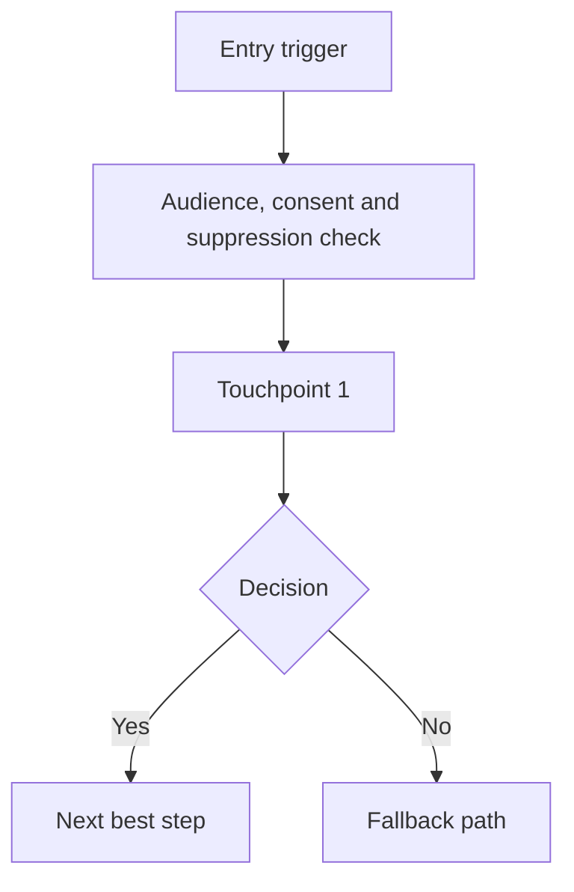

# [Journey Name]

## 1. Executive Summary

State the customer problem, business outcome, primary KPI, journey scope, and platform stack in one or two concise paragraphs.

## 2. Confirmed Requirements

- 

## 3. Assumptions

- 

## 4. Open Questions

- 

## 5. Journey Strategy

Include objective, customer goal, lifecycle stage, audience, trigger, entry criteria, exclusions, exits, re-entry, channel role, and success metric.

## 6. Platform Implementation Plan

Explain how the ideal journey maps to the selected stack and which platform owns each responsibility.

## 7. Platform Capability Matrix

| Capability | Recommended owner | Backup option | Notes |
|---|---|---|---|
| Audience definition |  |  |  |
| Audience activation |  |  |  |
| Journey orchestration |  |  |  |
| Dynamic content |  |  |  |
| Survey or feedback |  |  |  |
| Reporting |  |  |  |
| Compliance |  |  |  |

## 8. Journey Diagram



## 9. Journey Element Details

### Step 1: [Step name]

- Purpose:
- Tool/platform:
- Platform object:
- Channel:
- Trigger/timing:
- Audience condition:
- Content:
- Personalisation:
- Data used:
- Tracking event:
- Success metric:
- Decision logic:
- Fallback logic:
- Suppression/compliance checks:
- Owner:
- Build notes:

## 10. Decision Logic

| Decision | Rule | Yes path | No path | Fallback |
|---|---|---|---|---|
|  |  |  |  |  |

## 11. Personalisation and Recommendation Logic

| Element | Required data | Primary rule | Fallback | Suppress if |
|---|---|---|---|---|
|  |  |  |  |  |

## 12. Testing Plan

| Test | Hypothesis | Variants | Split | Primary metric | Guardrails | Decision rule |
|---|---|---|---|---|---|---|
|  |  |  |  |  |  |  |

## 13. Survey and Feedback Plan

Include survey type, timing, embedded data, response routing, and closed-loop actions.

## 14. Tracking and Measurement Plan

Include events, properties, UTMs, conversion windows, attribution logic, dashboards, and alert thresholds.

## 15. Data Requirements

| Data | Type | Source | Required for | Fallback |
|---|---|---|---|---|
|  |  |  |  |  |

## 16. Compliance and Governance Checks

- Consent:
- Suppression:
- Frequency:
- Legal:
- Brand:
- Accessibility:
- Auditability:
- Approval gates:

## 17. Platform-specific Build Notes

### [Platform]

- 

## 18. Build Checklist

- [ ] 

## 19. YAML Journey Specification

```yaml
journey:
  name:
```

## 20. Optimisation Opportunities

1. [Improvement]
   - Why it helps:
   - Platform impact:
   - Data needed:
   - Risk:

